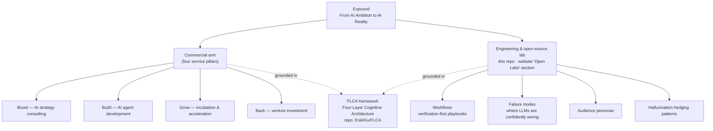
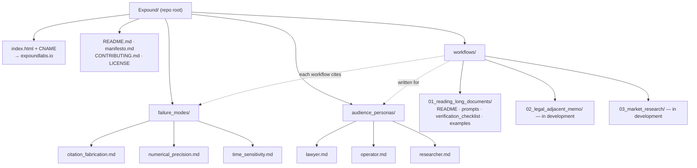
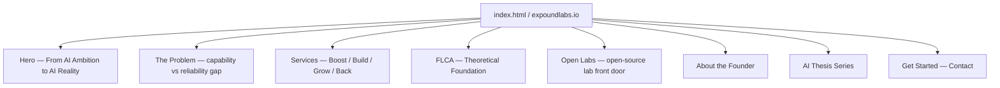

# Architecture

A map of how this project fits together: the Expound entity and its two arms,
this repository's structure, and the website's information architecture. Diagrams
are written in [Mermaid](https://mermaid.js.org/) and render directly on GitHub.

---

## 1. Conceptual architecture — Expound

One entity, two arms, both grounded in the FLCA framework.

---

## 2. Repository structure

`workflows/` is the core deliverable; it cites `failure_modes/` and targets the
people described in `audience_personas/`. `index.html` is the public website,
bound to `expoundlabs.io` via `CNAME`.

---

## 3. Website information architecture

Sections of `index.html`, top to bottom. The **Open Labs** section is the public
front door to this repository.

---

## Key relationships

- **One entity, two arms** — commercial services (four pillars) and the
  open-source lab (this repo); the website surfaces the latter as its
  **Open Labs** section.
- **Theory foundation** — both arms build on **FLCA**, which lives in its own
  repository, [`EskilXu/FLCA`](https://github.com/EskilXu/FLCA).
- **Repo = lab output** — `workflows/` (main deliverable), `failure_modes/`
  (cross-cutting knowledge), `audience_personas/` (who it's for), and
  `manifesto.md` (mission), all cross-referencing one another.
- **Website = unified public face** — `index.html` is hosted from this repo and
  pointed at expoundlabs.io via `CNAME`.
